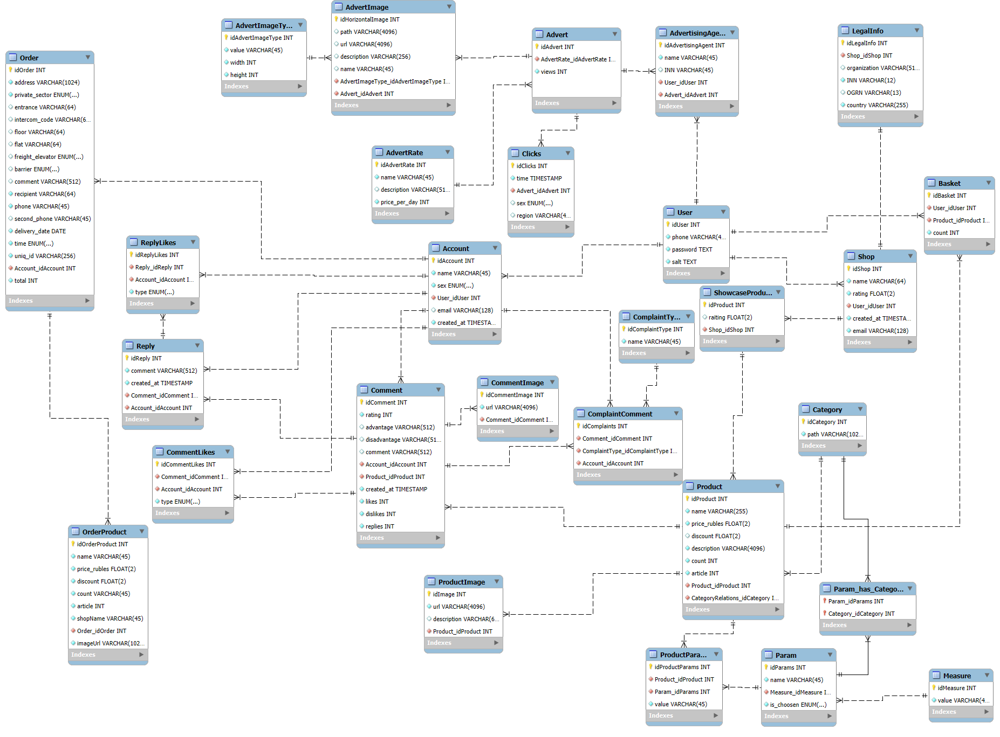

# Проект интернет-магазина 

На данный момент пока в разработке, однако backend практически написан, frontend в разработке.

## Backend

- NestJS
- TypeORM
- PostgreSQL

### Запуск

1. `npm install`
2. `npm run start:dev`

## Главный сайт для покупателей Frontend

- Angular (SPA)

### Запуск

1. `npm install`
2. `npm run start`

## Сайт управления магазином Frontend

- Angular (SSR)

### Запуск

1. `npm install`
2. `npm run start`

# О реализации

## Бэкенд

В бэкенде реализовано:
- 11 Entities, согласно логической модели:

- Авторизация, регистрация, выход, гарды на проверку jwt токена, refresh токена, наличия роли продавца, наличия роли покупателя  `backend\src\auth`
- Пользователь `backend\src\user`
- Магазин `backend\src\shop`
- Аккаунт покупателя `backend\src\account`
- Товар `backend\src\product`
- Группа товаров `backend\src\showcase-products`
- Параметры товаров `backend\src\param`
- Меры измерения параметров `backend\src\measure`
- Заказы `backend\src\order`
- Категории товаров `backend\src\category`
- Комментарии к товару `backend\src\comment`
- Вопросы к товару `backend\src\question`
- Загрузка изображений к товарам `backend\src\upload`
- Корзина покупателя `backend\src\basket`

Для базы данных используется PostgreSQL.

## Фронтенд покупателей

Пока не до конца реализован:
- написана UI-библиотека компонентов `tree_berezki-frontend-angular\app\shared`
- главная страница `tree_berezki-frontend-angular\src\app\pages\Main`
Самописанный макет: https://pixso.net/app/design/5ohDIL7tFgZ62oBFpV50bw 

## Фронтенд продавцов

Написан на SSR, можно создавать магазин, группу товаров, в группу товаров добавлять товар, его изображение.
Написан на скорую руку, поэтому реализованы страницы без UI-библиотеки:
- Авторизации пользователя `shop-manage-frontend-angular\src\app\pages\Auth`
- Регистрации пользователя `shop-manage-frontend-angular\src\app\pages\Register`
- Страница с созданными магазинами `shop-manage-frontend-angular\src\app\pages\User`
- Страница магазина `shop-manage-frontend-angular\src\app\pages\Shop`
- Страница создания магазина `shop-manage-frontend-angular\src\app\pages\CreateShop`
- Страница создания группы товаров `shop-manage-frontend-angular\src\app\pages\CreateGroup`
- Страница создания одного товара `shop-manage-frontend-angular\src\app\pages\CreateProduct`

Реализованы сервисы:
- Сервис авторизации `shop-manage-frontend-angular\src\app\core\services\auth.service.ts`
- Сервис товаров `shop-manage-frontend-angular\src\app\core\services\product.service.ts`
- Сервис магазинов `shop-manage-frontend-angular\src\app\core\services\shop.service.ts`
- Сервис пользователя `shop-manage-frontend-angular\src\app\core\services\user.service.ts`

Гарда для проверки авторизации:
`shop-manage-frontend-angular\src\app\core\guards\auth.guard.ts`